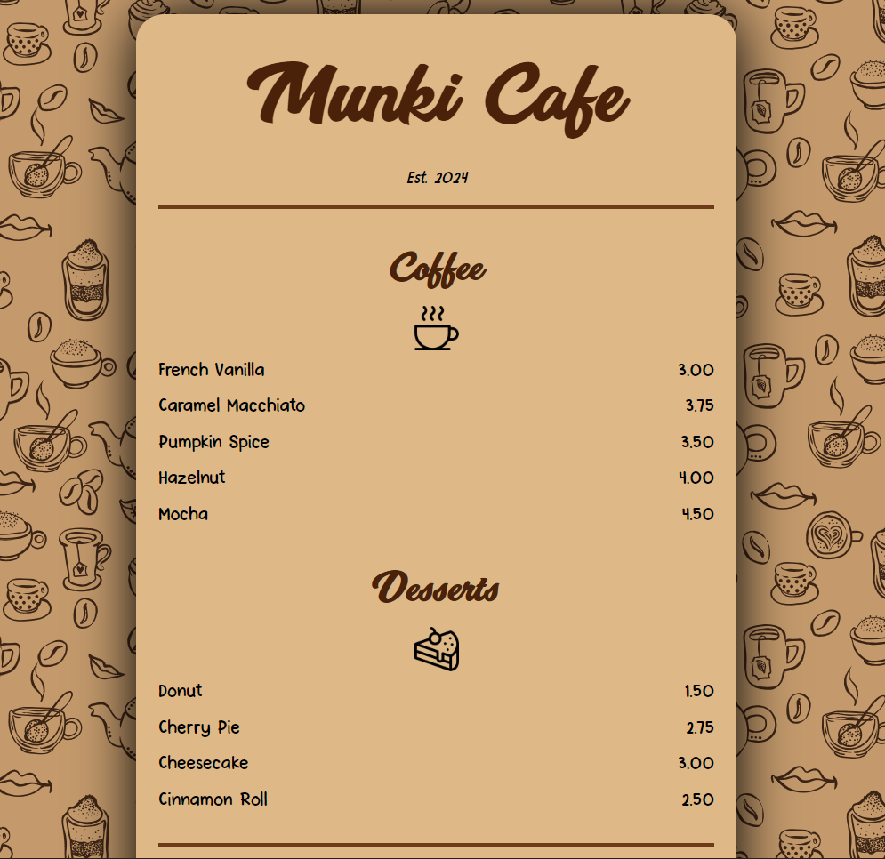

# ☕ Munki Cafe — Menu Page

A single-page, responsive cafe menu built with plain HTML & CSS. This was my first repository — built while working through [freeCodeCamp's](https://www.freecodecamp.org) Responsive Web Design curriculum.



## 🔗 Live Demo

[View the live menu](https://mukkiecookie.github.io/Cafe-Menu/cafe_menu.html)

## ✨ Features

- Clean, card-style menu layout with rounded corners and a soft drop shadow
- Two sections — **Coffee** and **Desserts** — each with an icon, item name, and price
- Custom Google-style pairing of two hand-picked fonts (`Breeze Personal Use` for headings, `PinkChicken-Regular` for body text) loaded via `@font-face`
- Fully responsive `max-width` container that scales down on smaller screens
- Subtle hover/active states on the footer link

## 🛠️ Built With

- **HTML5** — semantic structure (`<main>`, `<section>`, `<article>`, `<footer>`)
- **CSS3** — custom fonts, flexbox-free layout with `display: inline-block`, box-shadow, and responsive sizing
- No frameworks, no JavaScript — just fundamentals

## 📂 Project Structure

```
Cafe-Menu/
├── cafe_menu.html      # main page markup
├── styles.css           # all styling + font-face declarations
├── fonts/                # custom .ttf fonts used in the design
├── coffee.png            # coffee section icon
├── cake.png               # desserts section icon
├── coffee-5417663.svg     # background pattern
└── README.md
```

## 🚀 Running It Locally

No build step needed — it's static HTML/CSS.

```bash
git clone https://github.com/mukkiecookie/Cafe-Menu.git
cd Cafe-Menu
open cafe_menu.html   # or just double-click the file
```

## 📖 What I Learned

This project was my introduction to:
- Using `@font-face` to load and pair custom fonts
- Structuring a page with semantic HTML tags instead of generic `<div>`s
- Basic responsive layout using percentage widths and `max-width`

## 📄 License

This project is licensed under the MIT License — see the [LICENSE](LICENSE) file for details.

---

Made by [Mukul](https://behance.net/mukkiecookie) · based on a [freeCodeCamp](https://www.freecodecamp.org) tutorial project
